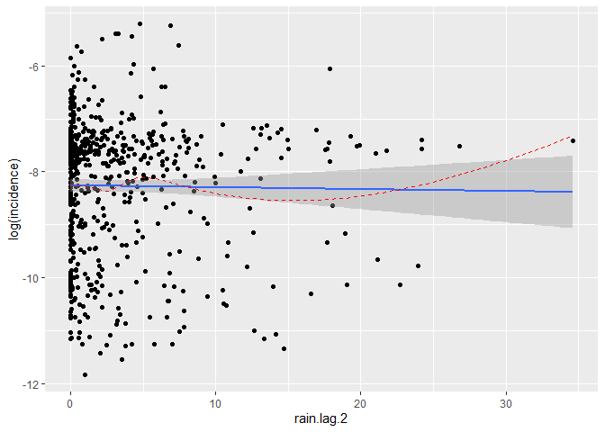
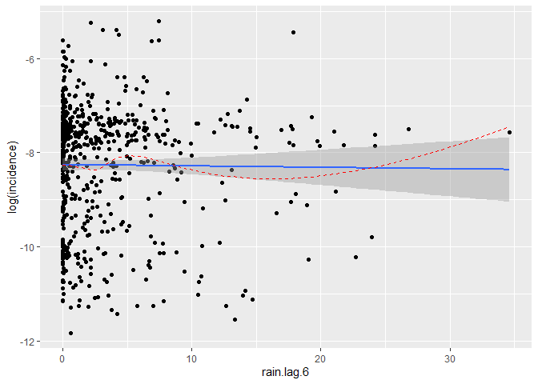
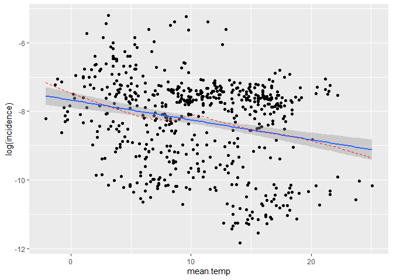
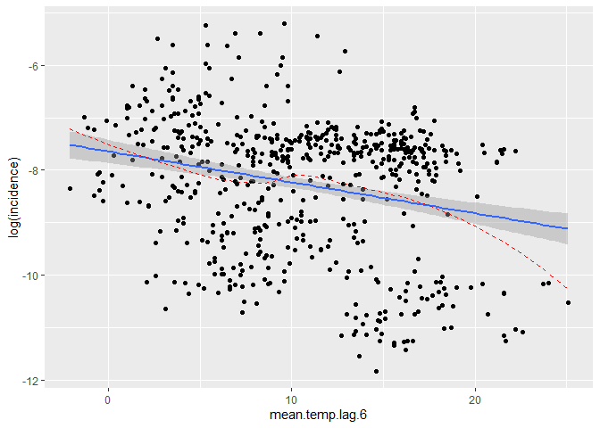
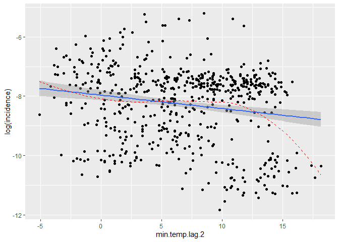
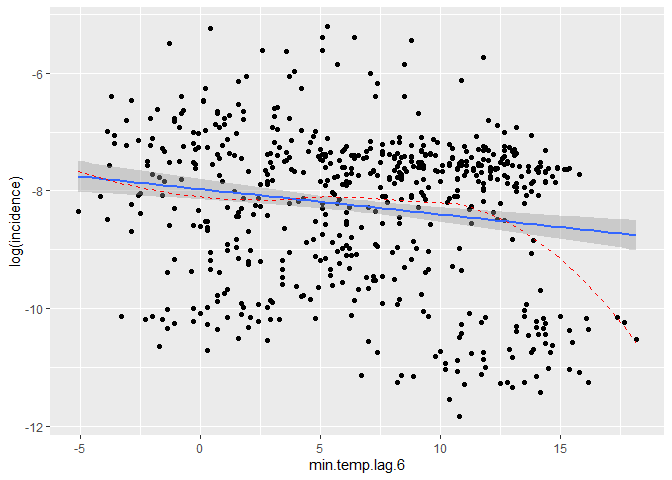
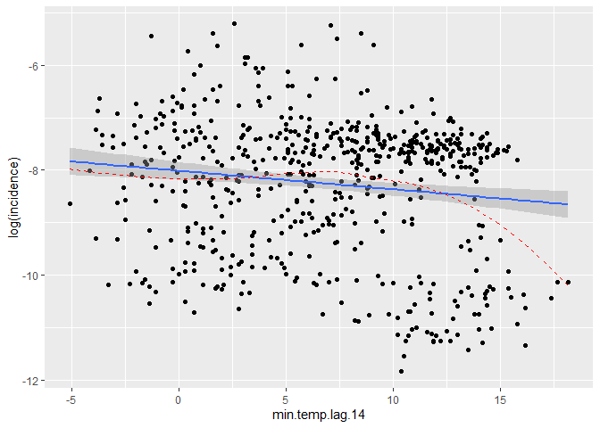
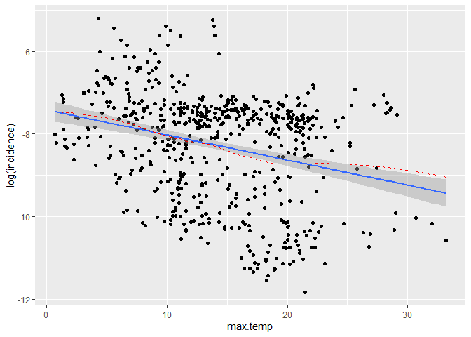
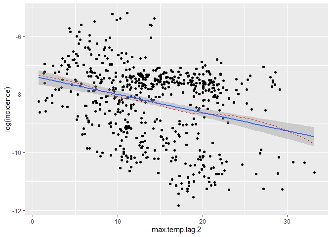
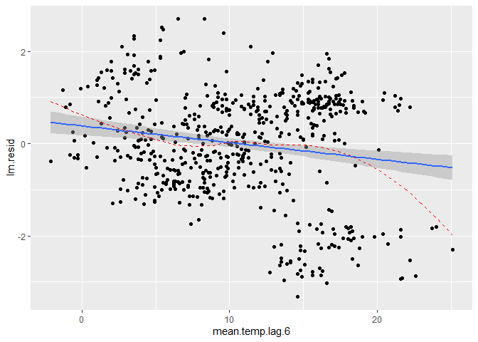

Research Project 1 (aka mini-project)
================

# Data Sources and cleaning

## Sources

These were the data sources used:

-   COVID Data: [UK Coronavirus
    Dashboard](https://coronavirus.data.gov.uk/ "UK COVID Dashboard")
-   Population: [ONS Population
    Estimates](https://www.ons.gov.uk/peoplepopulationandcommunity/populationandmigration/populationestimates/datasets/populationestimatesforukenglandandwalesscotlandandnorthernireland "UK Population Estimates")
-   Lockdown timeline:
    -   [Institute for
        Government](https://www.instituteforgovernment.org.uk/sites/default/files/timeline-coronavirus-lockdown-december-2021.pdf)
    -   [House of Commons
        library](https://researchbriefings.files.parliament.uk/documents/CBP-9068/CBP-9068.pdf)
-   Temperature: Met Office [Hadley Centre Central England Temperature
    Data](https://www.metoffice.gov.uk/hadobs/hadcet/data/download.html "HadCET")
-   Rainfall: Met Office Hadley Centre observations datasets:
    [HadUKP](https://www.metoffice.gov.uk/hadobs/hadukp/ "HadUKP")

## Data Cleaning

### Temperature Data

Data was saved as a `.txt` file. It is stored as follows:

-   The first column corresponding to the year
-   The second column corresponding to the day
-   Each column thereafter corresponding to the month (12 columns, one
    for each month).

Each cell represents daily values, expressed in tenths of a °C.

To import data, I created the following function

``` r
clean.temp.data <- function(data, temp.name){
  
  require(reshape2)
  require(lubridate)
  
  temp <- read.fwf(data,
                   widths = rep(5, 14),
                   header = FALSE,
                   col.names = c("Year", "Day",
                                 "Jan", "Feb", "Mar", "Apr",
                                 "May", "Jun", "Jul", "Aug",
                                 "Sep", "Oct", "Nov", "Dec"))
  
  
  # change -999 to NA
  temp[temp == -999] <- NA
  
  # wide to long
  temp <- melt(temp, id = c("Year", "Day"))
  names(temp)[c(3,4)] <- c("Month", temp.name)
  
  # change month to factor
  
  temp$Month <- factor(temp$Month,
                       levels = c("Jan", "Feb", "Mar", "Apr",
                                  "May", "Jun", "Jul", "Aug",
                                  "Sep", "Oct", "Nov", "Dec"),
                       ordered = TRUE)
  
  # introduce decimal points 
  
  temp[[temp.name]] <- (temp[[temp.name]])/10
  
  
  # order data frame by Year, Month and then Day 
  
  temp <- temp[order(temp$Year,
                     temp$Month,
                     temp$Day),]
  
  # Create date variable combining Year, Month and Day 
  
  temp$date <- paste(temp$Year, as.numeric(temp$Month), temp$Day,
                     sep = "-")
  
  temp$date <- ymd(temp$date)
  
  return(temp)
  
}
```

I used this function to import minimum, maximum and mean daily
temperatures into a data frame in R.

``` r
mean.temp <- clean.temp.data(data = "raw_data/daily_HadCET_1772_2022.txt",
                             temp.name = "mean.temp")

min.temp <- clean.temp.data(data = "raw_data/daily_min_HadCET_1878_2022.txt",
                            temp.name = "min.temp")

max.temp <- clean.temp.data(data = "raw_data/daily_max_HadCET_1878_2022.txt",
                            temp.name = "max.temp")
```

### Rainfall Data

Rainfall is stored in mm/day. The format of the raw data is similar to
that of the HadCET data, where: \* First column is Year \* Second column
is the Month, stored in its numerical version \* The rest of the columns
correspond to the day, from 1 to 31

The following code was used to clean up the rainfall data and create a
data frame.

``` r
rain <- read.fwf("raw_data/daily_rainfall_NWEP_HadUKP.txt", 
                 widths = c(5, 5, rep(7, 31)),
                 header = FALSE)

# rename columns
names(rain) <- c("Year", "Month", seq(1, 31, by = 1))

# change -99.99 to NA

rain[rain==-99.99] <- NA

# wide to long 

rain <- melt(rain, id = c("Year", "Month"))

names(rain)[c(3,4)] <- c("Day", "rain")

# order data by Year, Month and Day 

rain <- rain[order(rain$Year,
                   rain$Month,
                   rain$Day),]

# create date column

rain$date <- paste(rain$Year, rain$Month, rain$Day,
                   sep = "-")
rain$date <- ymd(rain$date)
```

### COVID data

COVID data came fairly well cleaned and needed minimum wrangling. I
imported the full data set, containing cases, deaths and vaccinations. I
also had a separate dataset with reinfections. (This had to done
separately due to the restriction imposed by UK Gov, where a maximum of
5 variables can be downloaded at a time).

``` r
covid <- read.csv("raw_data/region_2022-02-24.csv")
reinf <- read.csv("raw_data/reinfections.csv")

covid$date <- ymd(covid$date)
reinf$date <- ymd(reinf$date)

covid <- merge(covid, reinf[,c(4,5)], by = "date")
```

In the vaccination variables, the data for the dates where vaccines had
not been rolled out yet had been stored as `NA`. Therefore, to make sure
this is not considered as missing data, these have to be changed to 0.

``` r
covid$newPeopleVaccinatedSecondDoseByVaccinationDate[is.na(covid$newPeopleVaccinatedSecondDoseByVaccinationDate)] <- 0 

covid$newPeopleVaccinatedThirdInjectionByVaccinationDate[is.na(covid$newPeopleVaccinatedThirdInjectionByVaccinationDate)] <- 0
```

Once this data set was ready, I merged the environmental variables into
this data frame.

``` r
covid <- merge(covid, rain[,c(4,5)], by = "date")
covid <- merge(covid, mean.temp[,c(4,5)], by = "date")
covid <- merge(covid, min.temp[,c(4,5)], by = "date")
covid <- merge(covid, max.temp[,c(4,5)], by = "date")
```

### Population data

As the ONS only produces a single population estimate per year, and the
most recent one corresponds to mid-2020, this was introduced into the
`covid` data frame as a constant number across all entries.

The population for mid-2020 was 7 367 456.

# Data analysis

## Exploratory data analysis

### COVID data frame

Before beginning any exploratory data analysis, I had to create a `t`
variable. This corresponds to the increase in time. In this case, `t` is
day.

``` r
covid$t <- as.numeric(covid$date)-(min(as.numeric(covid$date)))+1
```

I also had to manually create a lockdown variable. This is an indicator
variable, where 1 shows current lockdown and 0 shows no lockdown.

I assumed lockdown was either a full national lockdown or a regional
Tier 4 lockdown for the North West. I also assumed that the end of
lockdown periods corresponded to either the end of national lockdown or
moving into step 1, where stay-at-home orders were raised.

``` r
covid$lockdown <- rep(0, length(covid$date))

# second lockdown
covid$lockdown[covid$date > ymd("2020-11-04") & 
                 covid$date < ymd("2020-12-02")] <- 1

# third lockdown 
covid$lockdown[covid$date > ymd("2020-12-25") & 
                 covid$date < ymd("2021-03-30")] <- 1
```

### COVID plots

Once these variables were created, I was able to plot the cases of COVID
against time.


It is easier to see trends on the log scale, so I also created a plot
using this scale:


### Create lagged variables

The next step was to create lagged environmental variables. I built the
following function to help me with this:

``` r
create.lag.var <- function(x,lag,data) {
  
  tlag <- data$t-lag
  
  ind.lag <- sapply(tlag,function(k) {
    
    out <- which((data$t-k)==0)
    
    if(length(out)==0) out <- NA
    
    return(out)
  })
  
  x[ind.lag]
}
```

This function doesn’t assume that there is data for every time point.

I used this function within a `for()` loop to create lags of 2, 7, 10
and 28 days for each of the environmental variables (rainfall, mean
temperature, minimum temperature and maximum temperature).

``` r
env.vars <- c("rain", "mean.temp", "min.temp", "max.temp")

for (i in 1:length(env.vars)) {
  
  lags <- c(2, 6, 14)
  
  for (j in 1:length(lags)) {
    
    covid[[paste0(env.vars[i], ".lag.", lags[j])]] <- create.lag.var(x = covid[[env.vars[i]]],
                                                                     lag = lags[j],
                                                                     data = covid)
    
  }
  
}
```

### Compare variables against log(incidence)

Once I created the lagged variables, I could compare these against my
outcome of interest. As I will be modelling `log(incidence)`, I will use
this against the different variables.

**Rain**



No clear correlation

**Mean Temperature**



Some possible correlation, maybe stronger at lag 2, lag 6 and lag
14.Possible spline effect.

**Minimum temperature**



Very weak correlation, if any at all, but some possible spline effect
after approx min.temp = 12. This is particularly true in no lag, lag 2,
lag 6 and lag 14.

**Maximum temperature**



Some correlation. Plots show an interesting pocket where no data is
found.

## Linear regression models

To compare the effects of the different environmental variables, I used
a linear regression model to estimate the effects. In this model, I
accounted for the effects of other variables, which included:

-   Temporal pattern of covid incidence
-   Lockdown periods
-   2nd and 3rd vaccination numbers

To see how accounting for the effects of these variables, I used them to
build a ‘base model’. I then extracted the residuals from this ‘base
model’ and plotted them against each environmental variable that I have.

**Rain**

    ## $no.lag

<!-- -->

    ## 
    ## $lag.2

<!-- -->

    ## 
    ## $lag.6

<!-- -->

    ## 
    ## $lag.14

<!-- -->

**Mean temperature**

    ## $no.lag

<!-- -->

    ## 
    ## $lag.2

<!-- -->

    ## 
    ## $lag.6

<!-- -->

    ## 
    ## $lag.14

<!-- -->

**Maximum temperature**

    ## $no.lag

<!-- -->

    ## 
    ## $lag.2

<!-- -->

    ## 
    ## $lag.6

<!-- -->

    ## 
    ## $lag.14

<!-- -->

**Minimum temperature**

    ## $no.lag

<!-- -->

    ## 
    ## $lag.2

<!-- -->

    ## 
    ## $lag.6

<!-- -->

    ## 
    ## $lag.14

<!-- -->

### Compare models

I decided to compare the models which used each environmental variable
one at a time. I compared the coefficient, the p-value for each
coefficient and the AIC value for each model.

| env.var          |  coef | p.value | signif |      aic |
|:-----------------|------:|--------:|:-------|---------:|
| rain             | 0.988 |   0.222 | \-     | 1849.329 |
| rain.lag.2       | 0.988 |   0.217 | \-     | 1849.295 |
| rain.lag.6       | 0.984 |   0.105 | \-     | 1848.172 |
| rain.lag.14      | 0.988 |   0.232 | \-     | 1849.391 |
| mean.temp        | 0.958 |   0.000 | \*\*\* | 1835.321 |
| mean.temp.lag.2  | 0.954 |   0.000 | \*\*\* | 1831.617 |
| mean.temp.lag.6  | 0.949 |   0.000 | \*\*\* | 1825.896 |
| mean.temp.lag.14 | 0.957 |   0.000 | \*\*\* | 1834.331 |
| min.temp         | 0.970 |   0.005 | \*\*   | 1843.020 |
| min.temp.lag.2   | 0.965 |   0.001 | \*\*   | 1840.391 |
| min.temp.lag.6   | 0.961 |   0.000 | \*\*\* | 1837.825 |
| min.temp.lag.14  | 0.972 |   0.012 | \*     | 1844.440 |
| max.temp         | 0.956 |   0.000 | \*\*\* | 1829.615 |
| max.temp.lag.2   | 0.953 |   0.000 | \*\*\* | 1825.803 |
| max.temp.lag.6   | 0.948 |   0.000 | \*\*\* | 1817.637 |
| max.temp.lag.14  | 0.953 |   0.000 | \*\*\* | 1825.876 |
